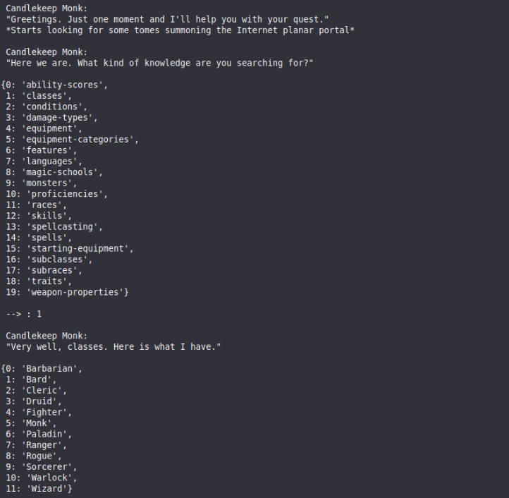
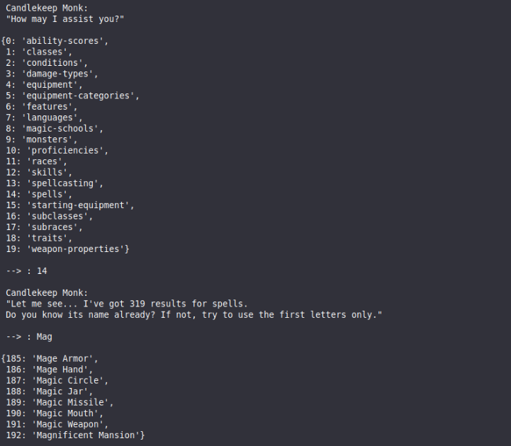
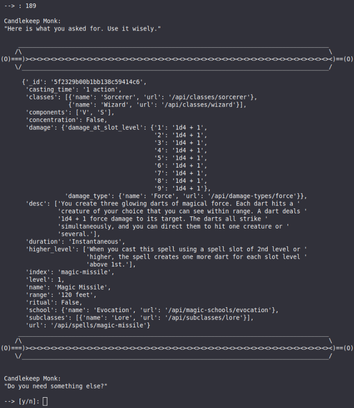

# Spectorial
Instant access in the terminal to the D&amp;D 5e knowledgebase through the [official RESTful API](https://www.dnd5eapi.co/).

* A Candlekeep monk will retrieve for you the information you are looking for. So no need to interact with the code.
* Said monk is very efficient, therefore the app is also suitable to search things on-the-fly during sessions.
* See the screenshots to look at how the requests are carried out.

## Using Spectorial

Clone the repository. Run `spectorial.sh` to execute Spectorial. Done.

```
git clone https://github.com/alussana/spectorial
cd spectorial
bash spectorial.sh
```

The information is readily retrieved and displayed with a minimal amount of input. Here are a couple of examples:

* Initialization, browsing cathegories:



* Searching and displaying Magic Missile:



